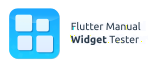

<!-- 
This README describes the package. If you publish this package to pub.dev,
this README's contents appear on the landing page for your package.

For information about how to write a good package README, see the guide for
[writing package pages](https://dart.dev/guides/libraries/writing-package-pages). 

For general information about developing packages, see the Dart guide for
[creating packages](https://dart.dev/guides/libraries/create-library-packages)
and the Flutter guide for
[developing packages and plugins](https://flutter.dev/developing-packages). 
-->

<p align="center">
  
</p>

**flutter_manual_widget_tester** is a Flutter package that allows you to manually test your Flutter widgets in isolation. It provides a simple UI to interact with your widgets and modify their properties:

 <!-- TODO: insert screenshot here -->

## Getting Started
Let’s assume we are developing a `CustomList` widget which displays a list of items. It is given a list of strings as well as a heading string. It then displays the heading and the list of items, while styling the heading according to a set of provided colors. Let’s write the code for the first version:

```dart
class CustomList extends StatelessWidget {
  const CustomList({
    super.key,
    required this.headerColor,
    required this.headingColor,
    required this.stringList,
    required this.heading,
  });

  final Color headerColor;
  final Color headingColor;
  final List<String> stringList;
  final String heading;

  @override
  Widget build(BuildContext context) {
    return Column(
      crossAxisAlignment: CrossAxisAlignment.stretch,
      children: [
        Container(
          color: headerColor,
          height: 32.0,
          child: Center(
            child: Text(
              heading,
              style: TextStyle(
                color: headingColor,
              ),
            ),
          ),
        ),
        Expanded(
          child: SingleChildScrollView(
            child: Column(
                children: stringList.map((e) {
              return SizedBox(
                height: 32.0,
                child: Text(e),
              );
            }).toList()),
          ),
        ),
      ],
    );
  }
}
```

Now, to manually test this `CustomList` widget, we can use the `ManualWidgetTester` provided by this package. To do so, make sure your `MyApp` class’ `MyHomePage` builds a `ManualWidgetTester` like so:

```dart
void main() {
  runApp(const MyApp());
}

class MyApp extends StatelessWidget {
  const MyApp({Key? key}) : super(key: key);

  @override
  Widget build(BuildContext context) {
    return const MaterialApp(
      home: MyHomePage(),
    );
  }
}

class MyHomePage extends StatefulWidget {
  const MyHomePage({Key? key}) : super(key: key);

  @override
  State<MyHomePage> createState() => _MyHomePageState();
}

class _MyHomePageState extends State<MyHomePage> {
  @override
  Widget build(BuildContext context) {
    return ManualWidgetTester(
      builders: [
        WidgetTestBuilder(
          id: 'custom list',
          name: 'Custom List',
          icon: Icons.list,
          builder: (context, settings) {
            final headerColor = settings.getSetting(
              'headerColor',
              const Color.fromRGBO(0, 0, 255, 1.0),
            );
            final headingColor = settings.getSetting(
              'headingColor',
              const Color.fromRGBO(255, 255, 255, 1.0),
            );

            final numberOfItems = settings.getSetting('numberOfItems', 10);
            final stringList = List.generate(
              numberOfItems,
              (index) => 'Item $index',
            );

            final heading = settings.getSetting('heading', 'Custom List');

            return CustomList(
              headerColor: headerColor,
              headingColor: headingColor,
              stringList: stringList,
              heading: heading,
            );
          },
        ),
      ],
    );
  }
}
```

As you can see, `ManualWidgetTester` receives a list of `WidgetTestBuilder` instances. Each `WidgetTestBuilder` represents a widget you want to manually test. It receives an ID which is to be kept consistent across hot reloads, a name and icon to display in the UI, and most importantly the `builder` function which builds the widget you want to test. The `builder` method receives a `WidgetTestSessionCustomSettings` instance which provides access to the settings that can be modified in the UI. Here, we are using settings to modify the `headerColor`, `headingColor`, `numberOfItems`, and `heading` properties of the `CustomList` widget.

If we now run this app and click the plus icon in the top right, we will see our `Custom List` widget in the list. Clicking it will load the UI to modify its settings and view the widget. The window should look like this:


We can use the sidebar to modify the settings of the widget, change the current zoom level using the buttons on the bottom, resize the widget using the resize handles and interact with the widget as we normally would in our app. Any changes to the settings will automatically rebuild the widget and update the view. For instance, we can click the `headerColor` button and change the color to see the header update in real time.


$$\Downarrow$$


Additionally, we can change “generic settings,” such as the current media query properties or the default text style.

In fact, if we increase the default font size, we find our first error. The list items do not have enough height to accommodate the larger text. Additionally, our widget appears to not respect the padding defined in the media query. These errors might go unnoticed when testing within our app, because there would be no way to manually modify these generic settings. Let’s fix those errors and perform a hot reload. The code now looks like this:

```dart
class CustomList extends StatelessWidget {
  const CustomList({
    super.key,
    required this.headerColor,
    required this.headingColor,
    required this.stringList,
    required this.heading,
  });

  final Color headerColor;
  final Color headingColor;
  final List<String> stringList;
  final String heading;

  @override
  Widget build(BuildContext context) {
    return Column(
      crossAxisAlignment: CrossAxisAlignment.stretch,
      children: [
        Container(
          color: headerColor,
          child: SafeArea(
            child: Center(
              child: Text(
                heading,
                style: TextStyle(
                  color: headingColor,
                ),
              ),
            ),
          ),
        ),
        Expanded(
          child: SingleChildScrollView(
            child: Column(
                children: stringList.map((e) {
              return SizedBox(
                child: Text(e),
              );
            }).toList()),
          ),
        ),
      ],
    );
  }
}
```

More importantly, the custom list widget now respects the media query and has enough height for the larger text:


